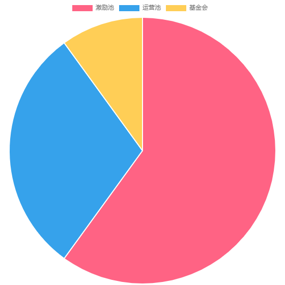

CST（学分币）－让学习更有价值。

# 一、CST（Credit for Study CST) 学分币 
CST是借助区块链赋能，反转学习模式，实现学习即挖矿的一种学习激励币。实现知识和CST双重收益。

## 1.1 背景
项目发起人在长期的教学活动中，对于学员学习的被动性有深入的观察。
发现大多数人感觉学习枯燥的原因在于激励反馈不明显。

从心理学上，人更倾向于短期的、回馈明显的活动。例如游戏，打牌等。  
这些活动在几分钟内就可以获得成功感或失败后的挑战感。

而学习则往往要到学期末或者几个月后才能看到成果，反馈周期过长，导致学员学习乏味。

借助区块链通证赋能，让学生的每个学习环节，都有相应的CST激励，缩短学习的反馈周期。

从学习角度，学员获得知识；
从收益角度，学员收获CST。

## 1.2 学习为什么应该有报酬？
### 1.2.1 学习对社会是增值的过程
人类因学习而不断进步，从来没见过哪个国家、民族越学习越后退的现象。

这是因为，学习对于社会是一个增值的过程。知识增长，技术变强，效率变高，继而提高生产，实现增值。

以老师的角度考虑，教学要付出很多心血，收费无可非议。

而另一个角度，老师的付出+学员的进步，对于社会整体却增值的过程。所以，学习不仅可以免费，还可以赚钱。

### 1.2.2 学习是一个创造的过程
学员在学习过程中，会总结出很多有价值的东西。  
如数学笔记、英语美文、记忆技巧、短视频等。

例：
+ [国外学霸1700页数学笔记](https://castel.dev/post/lecture-notes-1/)，其精美可以达到出版程度。
+ [清华学霸笔记](http://dy.163.com/v2/article/detail/D3S0VFUM0516IEB2.html)，已有出版商邀请出版。

同时，在学习过程中会有一些价值体现的过程。  
例如：编程学习中，为同学配置环境、答疑、调试Bug等过程。

这些有价值的东西很多，如笔记、资料等，大部分随着毕业就扔掉了。  
在学习过程的互助，如答疑、调试Bug等，也没谁好意思为对方要10元钱做报酬。

## 1.3 CST对学习形式的反转
传统学习论坛，如编程类论坛、数学论坛、百度知道等，一般会给优质资料上传者以金币，或者给答疑者金币。

这些论坛都是相互孤立，A论坛的金币不能拿到B论坛去用；
金币也不能变现，只能坛内消费；
论坛哪天不运营了，金币全作废。
综上，对学习者的激励不大。

如何能让学员的优质知识长久保存，并在分享中体现价值？
区块链，或许为我们找到答案。

在区块链上，学员学习过程的价值体现为CST。

学员学习过程中，优秀的作品、作业、笔记、答案、思路等发布到区块链，利用区块链不可逆的特点使其长久保存，并得到CST奖励。

学员在互助学习，如答疑、调试过程中，可以发布CST悬赏或直接转给对方CST,避免了直接付现金的尴尬。

利用区块链全球流通的特点，使得有知识兑价的CST，可以在各行业、各地区的学习过程中发挥价值。

这样，学员的学习过程产生的价值得到体现，优秀内容得以保存，互助过程也促进了CST的流通。

# 二、CST的功能

## 2.1 激励学习行为：
1. 讲师直播讲课；
2. 学员在线听课；
3. 学员完成作业；
4. 学员互助答疑；
5. 按要求建设社区；
6. 管理和培养优秀主题版块。

## 2.2 奖励社区贡献
一个蓬勃发展的社区离不开管理员的辛勤付出。在一门课程的教学活动中，都需要助教、管理、CST出纳等角色通力配合。管理组成员通常已经是该学习社区中的积极分子，也是该代币的投资者，他们通常已经在为该代币社区做很多志愿工作，CST希望让他们的付出获得相应回报。

## 2.3 付费私享群
付费私享群是意见领袖知识变现和影响力变现的一种实现方式，私享群的付费通过 CST 实现。

## 2.4 付费问答活动
用户社区发起问答活动，在一个时间段集中回答其他用户的提问。问答活动的付费通过 CST 实现。

## 2.5 打赏
CST 的单价不高，是一种非常好的打赏方式，是大咖与粉丝、讲师与学员之间有效的互动方式。对于优秀课程和优秀笔记的打赏，都将有助于平台形成良好的文化氛围。

# 三、总结
CST项目即利用通证把教学付出量化，学习成绩量化。凸显教、学、管理各过程中的激励效果。

用户对平台的各类贡献都将以不同形式获得回报，以鼓励更多正向行为，形成良性循环，促使平台加速发展。

# 四、CST分配
CST 的总量为 1000 亿，永不增发。 CST 的分配由 4 部分组成：激励池、推广运营池、CST基金会。

激励池的 CST 用于激励讲师和学员，数量为 600 亿 KEY，占总
量的 60%。激励池中的 CST 初始由智能合约锁定，按时间逐步释放。每年释放激励池余额的10%，即：第一年释放 60 亿 CST；第二年释放 54 亿 CST，以此类推，永续进行。

推广运营池的代币数量为 300 亿 CST，占代币总量的 30%，用于快速开拓新用户、吸引和激励活跃用户，以提高平台活跃度。

CST基金会持有 100 亿 KEY，占总量的 10%。CST基金会是一个非盈利性组织，其持有的 CST 将保障的技术开发工作得以完成，以及补贴运营和维护成本。

## 
代币分配

